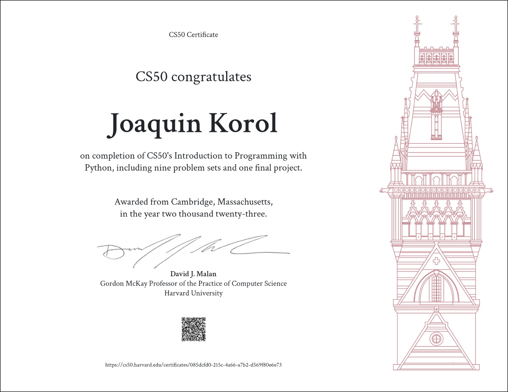

# Blackjack Game
#### Video Demo:  <https://youtu.be/p3LywGwGYYo>
## Description

This project represents my final proyect for CS50's Python course. It implements a Blackjack game using the Pygame library in Python. The game simulates a casino-style blackjack experience with a graphical user interface.

## Installation

To run the game, follow these steps:

1. Ensure you have Python installed on your system.
2. Install the Pygame library. You can do this via pip:
    ```
    pip install pygame
    ```
3. Download the project files.
4. Run the `main()` function in the Python script to start the game.

## Basic Rules of Blackjack

Blackjack, also known as 21, is a popular card game played in casinos. The objective is to beat the dealer by having a hand value as close to 21 as possible without going over.

- **Card Values:**
  - Number cards (2-10) are worth their face value.
  - Face cards (Jack, Queen, King) are all worth 10.
  - An Ace can be worth 1 or 11, whichever is more advantageous.

- **Gameplay:**
  - Players place bets before the game starts.
  - Each player and the dealer are dealt two cards.
  - Players can request additional cards (Hit) to increase their hand value or choose not to (Stand).
  - If a player's hand exceeds 21, they bust and lose the game.
  - The dealer must hit on 16 or less and stand on 17 or more.
  - The player wins if their hand is closer to 21 than the dealer's without exceeding 21.

## Classes

The classes in this project have been organized into separate files for better code structure and organization:

### Card

The `Card` class represents a playing card, storing its suit, rank, and providing methods to retrieve its image path and value.

### Deck

The `Deck` class creates a deck of 104 playing cards, manages shuffling, dealing cards, and calculating the value of a hand.

### Croupier

The `Croupier` class manages the dealer's actions, including dealing cards, following rules for hits/stands, and comparing hands.

### Player

The `Player` class represents the player in the game, handling their hand, bets, and balance.

### Chips

The `Chips` class handles the visual representation of different chip values for betting.

### Button

The `Button` class manages interactive buttons in the game's graphical interface, such as start, exit, deal, hit, and stand.

## Features and Possible Improvements

### Features Implemented:
- Basic gameplay including dealing, hitting, standing, and determining wins/losses.
- Visual representation of player's and dealer's cards.
- Betting using different chip values.

### Limitations:
- The current version does not include advanced functionalities like splitting or doubling down.
- The game uses a single deck; there's no option to choose the number of decks.

### Potential Improvements:
- Implement 'split' and 'double down' functionalities for more realistic gameplay.
- Allow users to select the number of decks to play with for added complexity and variety.

## Usage

Upon starting the game, you'll see a graphical interface with the following components:

- Start and Exit buttons for initiating and ending the game.
- Chip images for placing bets.
- Deal, Hit, and Stand buttons for playing the game.
- Player balance and bet information displayed.
- Visual representation of player and dealer cards.

To play the game:

1. Use the chip images to place a bet before clicking the "Deal" button.
2. Click "Deal" to start the game, receiving initial cards for the player and dealer.
3. Use "Hit" to request additional cards or "Stand" to end the player's turn.
4. The game determines the outcome based on card values and displays wins, losses, or pushes.
5. Restart the game or end it based on the on-screen prompts.
